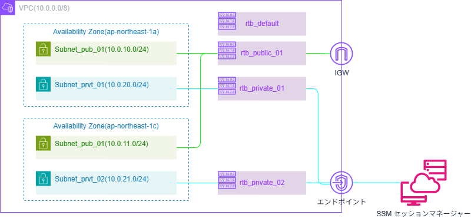

# ネットワーク設計
ネットワーク構成図を以下に記載する。  

構成要素は以下のとおり。
1. [VPC](#vpc)
1. [サブネット](#サブネット)
1. [ゲートウェイ / エンドポイント](#ゲートウェイ--エンドポイント)
1. [ルートテーブル](#ルートテーブル)
1. [ドメイン / DNS](#ドメイン--dns)
1. [TLS 証明書](#tls-証明書)

各構成要素の詳細を以下に記載する。

## VPC
VPC の基本情報は以下表のとおり。

| item_name | value | description |
|-|-|-|
| `Region` | ap-northeast-1 | - |
| `IPv4 CIDE` | 10.0.0.0/8 | - |
| `IPv6 CIDR` | IPv6 CIDR ブロックなし | - |
| `テナンシー` | default | - |

## サブネット
当該 VPC 内に以下のサブネットを作成する。  
マルチAZ構成が可能となるように ap-northeast-1a 及び、ap-northeast-1c に分散させる。

| Subnet Name | Availability Zones | IPv4 CIDR | Description |
|-|-|-|-|
| subnet_pub_01_apn1a | ap-northeast-1a | 10.0.10.0/24 | パブリックサブネットには ALB を配置する |
| subnet_pub_02_apn1c | ap-northeast-1c | 10.0.11.0/24 | - |
| subnet_prvt_01_apn1a | ap-northeast-1a | 10.0.20.0/24 | プライベートサブネットにはバックエンド及び DB を配置する |
| subnet_prvt_02_apn1c | ap-northeast-1c | 10.0.21.0/24 | プライベートサブネットにはバックエンド及び DB を配置する |

## ゲートウェイ / エンドポイント
当該 VPC 内に以下のゲートウェイ及び、エンドポイントを作成する。

| Name | Description |
|-|-|
| インターネットゲートウェイ | VPC 内部のリソースが外部（インターネット）と通信を行う必要がある場合、インターネットゲートウェイを経由して通信を行う |
| SSM エンドポイント | SSMセッションマネージャーを利用して EC2 へアクセスする場合、インターフェイスエンドポイントを経由して通信を行う |

## ルートテーブル
当該 VPC 内に以下のルートテーブルを作成する。

| Route Table Name | main | association | Description |
|-|-|-|-|
| rtb_default | true | - | デフォルトルートテーブルは基本的に利用しない |
| rtb_public_01 | false | subnet_pub_01_apn1a , subnet_pub_02_apn1c | - |
| rtb_private_01 | false | subnet_prvt_01_apn1a | - |
| rtb_private_02 | false | subnet_prvt_02_apn1c | - |

各テーブルのルートは以下の設定とする。

### rtb_default
当該ルートは以下の設定とする。
- VPC 内部の通信のみを可能とする

### rtb_public_01
当該ルートは以下の設定とする。
- VPC 内部のローカル通信を可能とする
- デフォルトゲートはインターネットゲートウェイを指定し、インターネットとの通信を可能とする

### rtb_private_01
当該ルートは以下の設定とする。
- VPC 内部の通信のみを可能とする

### rtb_private_02
当該ルートは以下の設定とする。
- VPC 内部の通信のみを可能とする

## ドメイン / DNS
Google Domains で取得したドメインから以下のサブドメインを払い出して利用する。  
本プロジェクトでは払い出したサブドメインは Route 53 に委任する。

| Item | Value | Description |
|-|-|-|
| `Apex Domain` | apexdomain | 本書の対象外とする |
| `Sub Domain` | cg_moc.apexdomain | - |

上記サブドメインから以下の Hostname を払い出す。  

| Host Name | Description |
| - | - |
| www.cg_moc.apexdomain | フロントエンドのホスト名として利用する |
| api.cg_moc.apexdomain | バックエンドのホスト名として利用する |
| gitlab.cg_moc.apexdomain | GitLab のホスト名として利用する |

## TLS 証明書
各ホストで利用する証明書は ACM で作成する。

